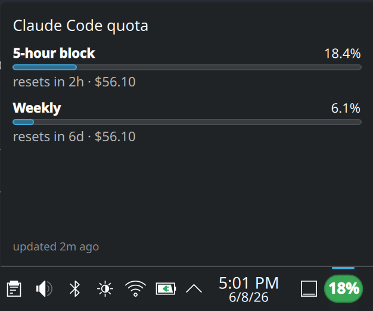
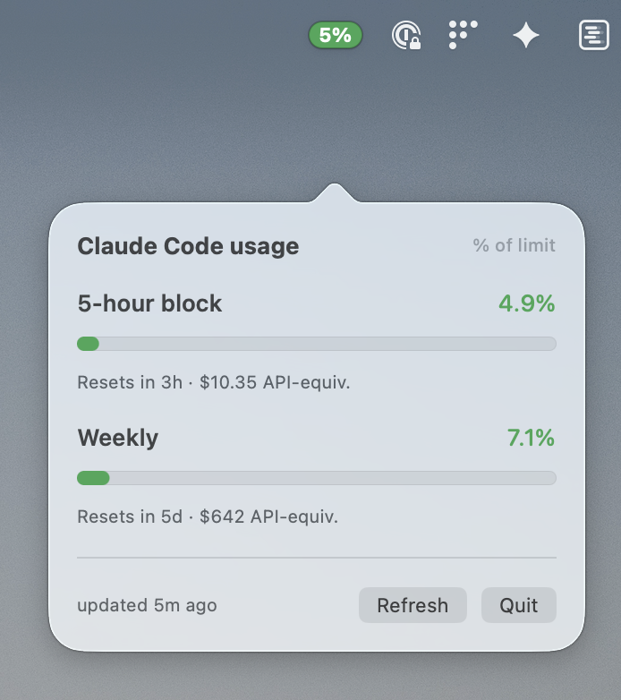
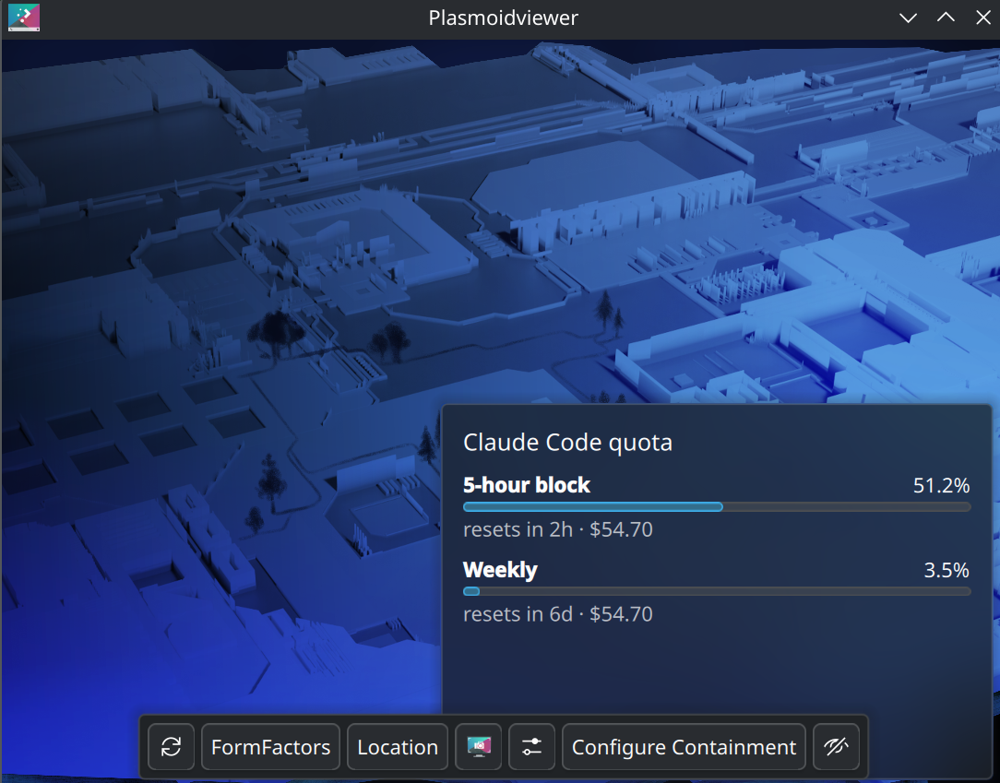

# Claude Code Quota Widget

A KDE Plasma 6 widget for Linux that puts your Claude Code subscription usage in your panel. Color-coded pill that turns green → amber → red as you approach the cap; click for the full breakdown.



> **Two platforms:** this repo ships a **KDE Plasma 6 widget** (Linux — the rest of this README) and a native **macOS menu-bar app** (in [`macos/`](macos/)). Both share the same ccusage-based data pipeline and calibration logic.

## macOS (menu-bar app)

A native Swift status-bar app: a color-coded **% pill in the menu bar**, click for the 5-hour + weekly breakdown. Same fetch pipeline as the Linux widget, with a `launchd` agent instead of a systemd timer.



```sh
git clone https://github.com/unjordi/claude-quota-widget
cd claude-quota-widget/macos
./install.sh          # or: just install
```

This builds `Claude Quota.app` into `~/Applications`, installs the fetch script + launchd agent, primes the cache, and launches the app. Look for the pill in your menu bar (top-right). To start it at login: **System Settings → General → Login Items → +**.

**Prerequisites:** macOS 13+, Xcode command-line tools (`swift` — `xcode-select --install`), `jq` (`brew install jq`), and Node.js (for `ccusage`).

Full details — calibration, the cost-vs-tokens explanation, development, and troubleshooting — are in **[macos/README.md](macos/README.md)**.

---

**The rest of this README covers the Linux / KDE Plasma 6 widget.**

## Why this exists

Claude Code's built-in `/usage` command only works inside an interactive Claude Code session. If you want to glance at your 5-hour-block and weekly utilization from anywhere on your desktop — without launching a Claude prompt and typing a slash command — there's no native way to do it.

This widget reads the **same usage data `/usage` shows** — via Anthropic's OAuth usage endpoint, using the token Claude Code already stores in `~/.claude/.credentials.json` — and puts it in your panel. When the endpoint is unreachable (offline / no credentials) it falls back to a calibrated estimate built from the local transcripts Claude Code writes (via [ccusage](https://github.com/ryoppippi/ccusage)). It's a "is now a good time to start a long Opus session?" indicator.

## What you see

Compact (always visible in the panel):

- A small color-coded pill showing your **5-hour block %**
- Green ≤ 60 %, amber 60–85 %, red > 85 %

Popup (click the pill):



- 5-hour block — progress bar, % used, resets-in, API-equivalent cost
- Weekly — progress bar, % used, resets-in, API-equivalent cost
- Last-refresh timestamp

Hover gives a one-line tooltip: `Claude Code: 5h 18% · wk 6%`.

## How it works

Three pieces, intentionally separated:

```
┌────────────────────────────────┐
│ 1. claude-quota-fetch          │ bash + jq + curl (OAuth) + ccusage
│    runs every 5 min via        │     ↓ writes
│    systemd --user timer        │ ~/.cache/claude-quota/state.json
└────────────────────────────────┘            ↑ reads
                                              │ (every 10s)
┌────────────────────────────────┐            │
│ 2. plasmoid (QML, Plasma 6)    │────────────┘
│    panel pill + popup + tip    │
└────────────────────────────────┘
```

The **systemd timer enforces the 5-minute refresh floor** at the kernel level — Anthropic's API issues abuse warnings if you poll the underlying data too aggressively, so the timer is the single source of truth for cadence (`OnUnitActiveSec=5min`, `Persistent=true`). The plasmoid is a pure view: it reads the cache file every 10 s and renders.

## Where the percentages come from

**Primary:** Anthropic's OAuth usage endpoint — the exact data `/usage` renders, including the real (rolling) reset times. When the fetch script can read Claude Code's OAuth token from `~/.claude/.credentials.json`, the widget's percentages **match `/usage` exactly** and the snapshot is marked `"basis": "oauth"`.

**Fallback:** when the endpoint is unreachable (offline, or no credentials), the script estimates from local JSONL transcripts via ccusage, dividing API-equivalent cost by the `*_CAP_USD` calibration constants (`"basis": "cost"`). This is an approximation — calibrate the caps in `~/.config/claude-quota/limits.env` against your own `/usage` reading if you rely on it. See **Tuning the fallback caps** below.

The dollar values shown in the popup are **API-equivalent** cost (what you'd have paid on pay-per-token), not your subscription billing. They're a "how much is my subscription saving me?" signal, not an invoice.

## Prerequisites

- **KDE Plasma 6** (Fedora 41+ / Kubuntu 24.04+ / Arch / others).
- **`jq`** for JSON normalization.
- **`npm`** to install `ccusage` (the installer runs `npm i -g ccusage` for you). If you already have `ccusage` on `PATH`, that's used directly. If neither is present, pass `--no-ccusage` to fall back to `npx -y ccusage@latest` at every fire (~7 s slower per refresh).

## Install

```sh
git clone https://github.com/unjordi/claude-quota-widget
cd claude-quota-widget
./install.sh
```

Or with [just](https://github.com/casey/just):

```sh
just install
```

Then in Plasma: right-click your panel → **Add or Manage Widgets…** → search **"Claude Code Quota"** → drag it onto the panel.

## Tuning the fallback caps

When the OAuth endpoint is reachable the percentages are exact and **no tuning is needed** — the caps only matter for the offline/no-credentials fallback. To calibrate, run `/usage` once and set each USD cap in `~/.config/claude-quota/limits.env` to **the popup's "$ used" ÷ the `/usage` fraction**:

```sh
$EDITOR ~/.config/claude-quota/limits.env
systemctl --user restart claude-quota.service
```

Rough starting points (eyeballed against `/usage` on Max 20x):

| Plan | `FIVE_HOUR_CAP_USD` | `WEEKLY_CAP_USD` |
|---|---|---|
| Pro | 2.5 | 250 |
| Max 5x | 11 | 1,200 |
| Max 20x | 45 | 4,800 |

(Older installs used `*_CAP_TOKENS` raw-token caps; those are no longer read — raw token counts are dominated by cache reads, which Anthropic's limits weight at ~0.1×, so they over-reported badly.)

## Troubleshooting

```sh
just status   # is the timer running? what was the last fetch?
just logs     # follow the fetch service journal
just refresh  # force a fetch right now and print the result
```

Common gotchas:

- **Pill stays gray with `…` text** — the cache file hasn't been written yet. Check `just status`; the first fetch can take a few seconds while `ccusage` cold-starts.
- **`error: cat rc=1`** — the fetch script crashed; check `journalctl --user -u claude-quota.service`. Usually a missing `jq` or `ccusage`.
- **Percentages way off from `/usage`** — check `jq .basis ~/.cache/claude-quota/state.json`. If it says `"cost"`, the OAuth endpoint isn't reachable (is `~/.claude/.credentials.json` present? are you online?) and you're on the calibrated fallback — see above. If it says `"oauth"`, the numbers come straight from Anthropic and should match.
- **Widget appears blank in the panel** — if you're seeing nothing at all (not even the colored pill), restart plasmashell once with `just reload-plasmashell`.

## Development

```sh
just upgrade-plasmoid    # rebuild + reinstall the plasmoid after editing main.qml
just reload-plasmashell  # restart plasmashell to pick up changes
just preview             # run the plasmoid standalone for visual debugging
just lint                # shellcheck the bash scripts
just package             # build dist/claude-quota-widget-X.Y.Z.plasmoid
```

## Uninstall

```sh
just uninstall              # remove everything
just uninstall-keep-cfg     # keep ~/.config/claude-quota/limits.env
```

## License

MIT. See [LICENSE](LICENSE).
