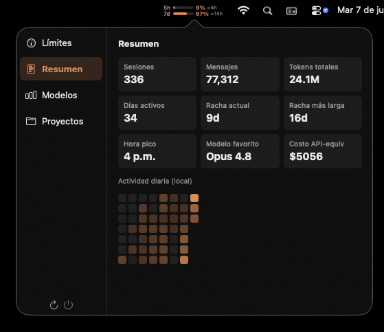
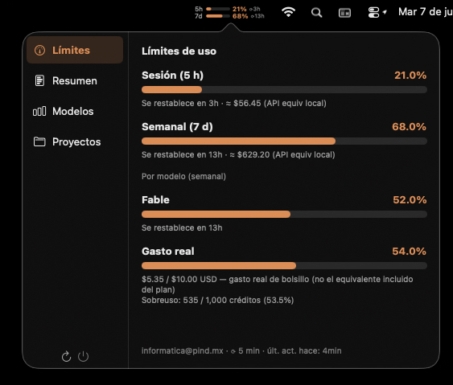
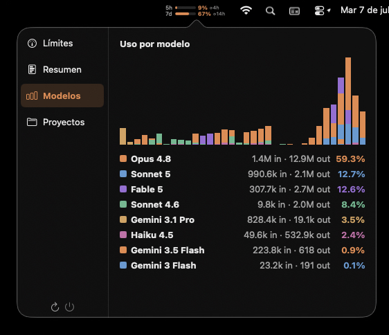
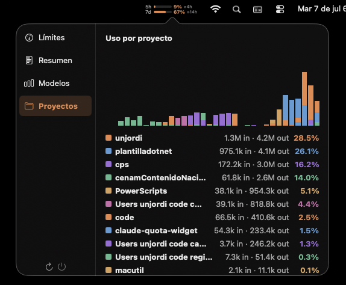
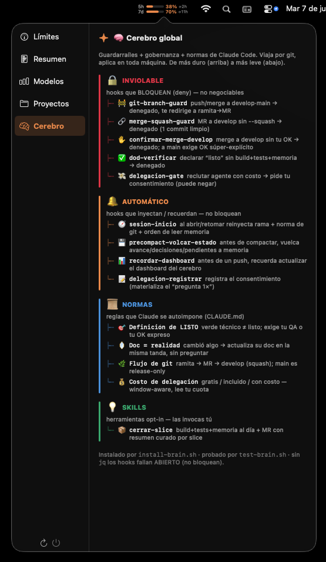

# 🧠 claude-brain

**The shared, global Claude Code brain** — guardrail hooks, delegation-cost governance, a hard
definition of *done*, and team git norms — **plus the quota widget that is its face**: a color-coded
pill (menu-bar / tray / panel) and a breakdown popup whose **Cerebro** tab maps the very brain you
installed. One `./install.sh` and your machine gets the guardrails, the usage daemon, and (optionally)
the widget. Idempotent and OS-agnostic — every hook runs under **bash** (macOS, Linux, Windows/Git Bash).

The brain is **not proprietary**: it ships no project-specific skills (no .NET, no company repos) —
only stack-agnostic hooks, norms, and one generic `cerrar-slice` skill any project can adopt.

> Grew out of [`fuziontech/claude-quota-widget`](https://github.com/fuziontech/claude-quota-widget)
> (MIT), restyled after [`FelixDes/claude-kde-usage-widget`](https://github.com/FelixDes/claude-kde-usage-widget),
> then extended from "a quota widget" into "a portable Claude Code brain with a widget face."

## Install

```sh
git clone https://github.com/unjordi/claude-brain
cd claude-brain
./install.sh                 # brain + quota daemon + desktop widget  (the full master install)
./install.sh --no-gui        # brain + daemon only  (skip the widget)
./install.sh --no-brain      # daemon + widget only (skip the Claude-Code brain)
```

Per-OS entry point: **Linux / KDE Plasma 6** → `./install.sh` at the repo root · **macOS** →
[`macos/`](macos/) (`./install.sh`, same flags) · **Windows** → [`windows/`](windows/)
(`pwsh -File install.ps1`). **Prerequisite for the guards: [`jq`](https://jqlang.github.io/jq/)** —
without it the hooks **fail open** (they don't block) and the installer can't wire `settings.json`;
on Windows you also need Git for Windows (bash + coreutils).

## The brain — what `install-brain.sh` lays down (globally, in `~/.claude`)

`./install.sh` runs [`brain/install-brain.sh`](brain/install-brain.sh) (skip with `--no-brain`),
idempotent and OS-agnostic. It installs, into `~/.claude`:

- **Git guardrails** (PreToolUse) — `git-branch-guard` (blocks `git push`/merge to `develop`/`main`,
  redirects to branch→MR→develop), `merge-squash-guard` (forces `--squash` into develop),
  `secret-scan` (blocks a commit/push whose staged content carries a **secret** — AWS/PEM/Anthropic/
  OpenAI/GitHub/GitLab/Slack/Google keys; escape with `--no-verify`), `rama-vieja` (warns — doesn't
  block — when a branch trails `origin/develop` badly), and the repo-scoped `confirmar-merge-develop`
  (demands explicit confirmation before integrating to develop; super-explicit for a release to main).
- **Delegation-cost governance** (Task) — when Claude recruits a sub-agent, `delegacion-gate` asks for
  consent by cost tier: **free** (local model), **included** (Claude *inside* your 5-hour window — no
  marginal cost), or **metered** (overage / paid external API / unknown). Free/included ask **once per
  machine**; metered **once per workflow**. `limite-gasto` is the hard ceiling that *blocks* recruiting
  when real spend passes a threshold; `delegacion-registrar` records the consent. The prompt reads the
  quota daemon's snapshot and shows your real window state, e.g.
  `Ventana 5h: 19% ($2.48 de $45; 3.7M tokens) · Semanal: 57% ($401/$4800)`. Tiers are configured in
  [`brain/hooks/agentes-costo.json`](brain/hooks/agentes-costo.json).
- **Session hygiene** (repo-scoped) — `sesion-inicio` (rehydrates branch + norms + memory at session
  start), `precompact-volcar-estado` (dumps state to memory before compaction), `dod-verificar` (Stop
  hook enforcing the definition of *done*).
- **The definition of "LISTO" (done)** — a hard, mutual norm: nothing is *done / working / in
  production* unless (1) the user confirmed the functionality, or (2) the user expressly authorized
  closing it. *Green build ≠ done.* Injected into `~/.claude/CLAUDE.md` (idempotent, marker-guarded)
  alongside the git flow, the mini-develop model, and the delegation-consent norm.
- **`cerrar-slice` skill** + a **brain dashboard** seed for the machine's global memory.

Repo-scoped hooks live in [`brain/hooks/`](brain/hooks/) as the source each repo copies into its own
`.claude/` and wires in its `settings.json` — a repo's hooks load only when a session *starts* in it.
The brain self-tests: [`brain/test-brain.sh`](brain/test-brain.sh) runs against an isolated fake
`$HOME` (**45 checks**), and CI repeats `bash -n` + `jq empty` + `shellcheck` on every push.

## The widget — the brain's face

A background daemon polls Anthropic's OAuth `/usage` and a native GUI shows a color-coded pill
(green → amber → red as you approach the cap); click it for the full breakdown. Same data as Claude
Code's `/usage`, on your desktop, from anywhere — a "is now a good time to start a long Opus session?"
signal. Three native ports share one fetch pipeline and one look:

### The breakdown tabs

Real captures of the app running (macOS menu-bar). All tabs share the left rail:

| | |
|---|---|
|  |  |
| **Resumen** — sessions, messages, tokens, streaks, peak hour, favorite model, API-equivalent cost, and the daily-activity heatmap. | **Límites** — 5-hour and weekly windows, per-model caps, and the **real out-of-pocket spend** (spend / overage). |
|  |  |
| **Modelos** — stacked bars per day + one row per model (in/out tokens, %). | **Proyectos** — stacked bars per day + one row per project folder (in/out tokens, %). |

### The `Cerebro` tab — live, self-healing, self-updating

<p align="center"></p>

Not a static poster — it **reads reality**:

- **Reflects** your `~/.claude`: which hooks are present and wired, which norms and skills are
  installed, laid out as a directory tree from 🔒 **INVIOLABLE** (blocks) → 🔔 **AUTOMÁTICO** →
  📜 **NORMAS** → 💡 **SKILLS**. To the user it reads binary — green = good, red = missing.
- **Heals** 🩹: if a piece is missing, one button runs the bundled `install-brain.sh` and re-reads —
  the brain completes itself, no terminal.
- **Self-updates** ⬆: each build embeds its version, checks the repo's `main`, and offers a banner
  that fast-forwards and reinstalls. Fail-open, and it never leaves you without a widget.

## How it works

`./install.sh` is one idempotent master installer; the daemon and the widget are intentionally
separate; the widget's **Cerebro** tab is the bridge back to the brain:

```
  ┌────────────────────────────────────────────────────────────────┐
  │  ./install.sh   —  one idempotent master installer               │
  └──────────────┬─────────────────────────────────┬────────────────┘
                 │ brain (install-brain.sh)         │ daemon + widget
                 ▼                                  ▼
  ┌───────────────────────────┐   ┌────────────────────────────────┐
  │  ~/.claude   (THE BRAIN)   │   │  claude-quota-fetch (daemon)   │
  │  hooks/ · settings.json    │   │  systemd / launchd · 5-min floor│
  │  CLAUDE.md · skills/       │   │  bash + jq + curl(OAuth) +ccusage│
  └───────────▲───────────────┘   └────────────────┬───────────────┘
              │ reads + 🩹 heals                    │ writes
              │  (install-brain.sh)                 ▼
              │                    ┌────────────────────────────────┐
              │                    │  ~/.cache/claude-quota/         │
              │                    │    state.json · stats.json      │
              │                    └────────────────┬───────────────┘
              │                                     │ reads every 10 s
  ┌───────────┴─────────────────────────────────────▼──────────────┐
  │  THE WIDGET  (the brain's face)  —  KDE · macOS · Windows        │
  │  pill  +  popup: Límites · Resumen · Modelos · Proyectos · 🧠     │
  │  🧠 Cerebro reflects the brain · 🩹 heals it · ⬆ self-updates     │
  └─────────────────────────────────────────────────────────────────┘
              ▲ autoupdate:  checks GitHub main  →  git ff + reinstall
```

The **timer enforces a 5-minute refresh floor** at the OS level — Anthropic's API warns on aggressive
polling, so the timer is the single source of cadence (`OnUnitActiveSec=5min`). The widget is a pure
view of `state.json`/`stats.json` (re-read every 10 s), except the Cerebro tab, which reads `~/.claude`
directly to reflect the brain.

### Where the percentages come from

**Primary:** Anthropic's OAuth usage endpoint — the exact data `/usage` renders (with real rolling
reset times). When the fetch script can read the OAuth token from `~/.claude/.credentials.json`, the
percentages **match `/usage` exactly** and the snapshot is marked `"basis":"oauth"`. **Fallback:**
offline / no credentials → estimate from local JSONL transcripts via
[ccusage](https://github.com/ryoppippi/ccusage), dividing API-equivalent cost by the `*_CAP_USD`
calibration (`"basis":"cost"`). Dollar values are **API-equivalent** cost (what pay-per-token would
have cost), not your subscription invoice — a "how much is my plan saving me?" signal.

## Platforms

| OS | GUI | Details |
|---|---|---|
| 🍎 **macOS** | menu-bar app (Swift) | [`macos/README.md`](macos/README.md) — `launchd` agent, calibration, dev, troubleshooting |
| 🐧 **Linux** | KDE Plasma 6 widget (QML) | this README (below) — `systemd --user` timer |
| 🪟 **Windows** | tray app (WinForms, .NET) | [`windows/README.md`](windows/README.md) — self-contained `.exe`, no bash/jq needed |

## Tuning the fallback caps (Linux/KDE — only matters offline)

When the OAuth endpoint is reachable the percentages are exact and **no tuning is needed**. For the
offline fallback, set each USD cap in `~/.config/claude-quota/limits.env` to the popup's *"$ used" ÷
the `/usage` fraction*, then `systemctl --user restart claude-quota.service`.

| Plan | `FIVE_HOUR_CAP_USD` | `WEEKLY_CAP_USD` |
|---|---|---|
| Pro | 2.5 | 250 |
| Max 5x | 11 | 1,200 |
| Max 20x | 45 | 4,800 |

## The "Proyectos" tab — naming and aliases

The fetch script aggregates per-project token usage from `~/.claude/projects/<slug>/` and **normalizes**
each slug to a canonical name: subdirectories and git worktrees under a known repo (from
`~/.claude.json`'s `.projects`) **merge into that repo** (longest-prefix at a segment boundary, so
`-Users-me-code-cps-cpscsmWasm` → `cps`); ephemeral `/tmp` worktrees collapse into one **`(worktrees)`**
bucket; anything else falls back to the **last path segment**. To rename a canonical project, drop a
map at `~/.claude/proyectos-alias.json` (`cp brain/proyectos-alias.example.json …`), applied after
normalization. The file is optional.

## Add the KDE widget to your panel

After `./install.sh`, in Plasma: right-click the panel → **Add or Manage Widgets…** → search
**"Claude Code Quota"** → drag it on.

## Troubleshooting (Linux)

```sh
just status   # is the timer running? last fetch?
just logs     # follow the fetch service journal
just refresh  # force a fetch now and print the result
```

- **Pill stays gray / `…`** — cache not written yet; first fetch is slow while `ccusage` cold-starts.
- **`error: cat rc=1`** — fetch crashed (`journalctl --user -u claude-quota.service`); usually missing `jq`/`ccusage`.
- **Percentages far from `/usage`** — `jq .basis ~/.cache/claude-quota/state.json`: `"cost"` means the
  OAuth endpoint isn't reachable (credentials? online?) and you're on the fallback; `"oauth"` matches Anthropic.
- **Blank in the panel** — restart plasmashell once: `just reload-plasmashell`.

## Development

```sh
just test-brain          # run the brain's 45-check suite (isolated fake $HOME)
just upgrade-plasmoid     # rebuild + reinstall the plasmoid after editing main.qml
just reload-plasmashell   # restart plasmashell to pick up changes
just lint                 # shellcheck the bash scripts
```

Contributing to the brain (add a guardrail, cut a release) is documented in the repo's own skills
[`.claude/skills/agregar-hook-cerebro`](.claude/skills/agregar-hook-cerebro/SKILL.md) and
[`.claude/skills/publicar-widget`](.claude/skills/publicar-widget/SKILL.md).

## Uninstall

```sh
just uninstall              # remove the widget + daemon
bash brain/uninstall-brain.sh   # remove the brain (idempotent, keeps your data)
```

`uninstall-brain.sh` removes the global hooks, config, skill, and the norms block from `~/.claude/CLAUDE.md`,
and un-wires only its own entries from `settings.json` — it never touches your memory, dashboard, or consent record.

## License

MIT. See [LICENSE](LICENSE). Original copyright fuziontech; retained.
