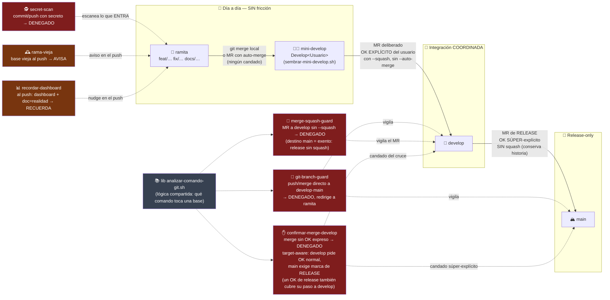
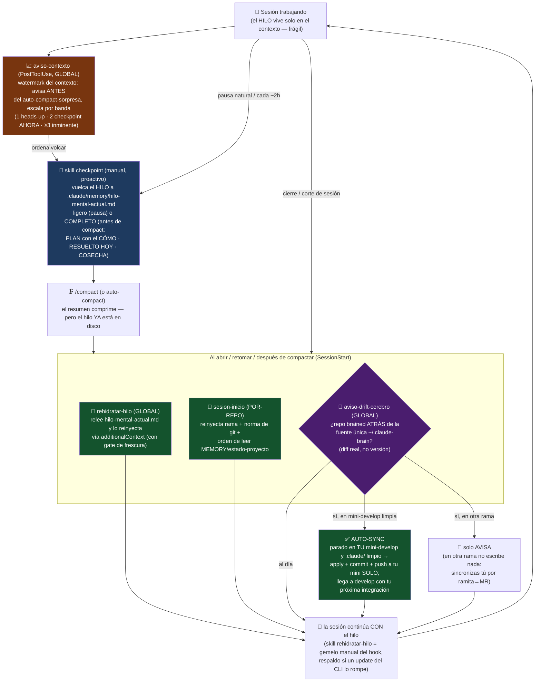
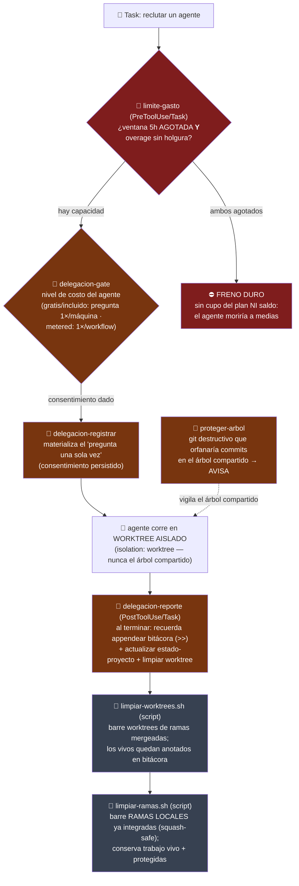
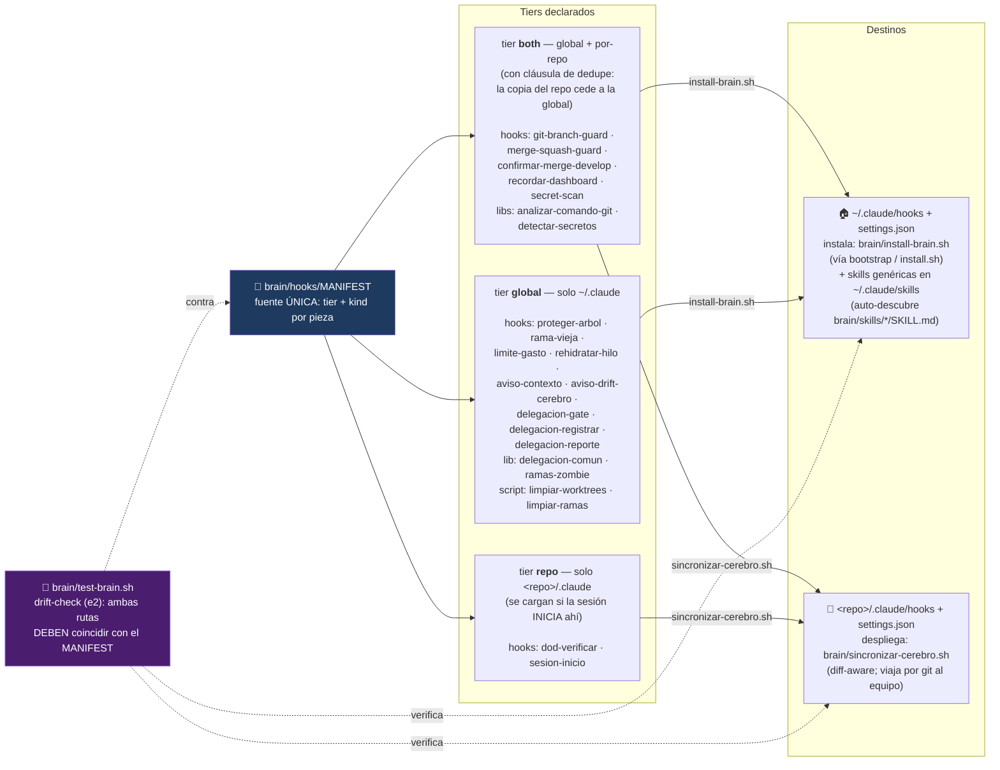

# 🗺️ Mapa del cerebro — versión navegable (Mermaid)

> Flowcharts del cerebro **visibles en GitHub** (Mermaid se renderiza nativo — no hace falta
> Graphviz ni yEd para *verlos*). Un diagrama por capa: el flujo de git con sus guards, el ciclo
> del hilo/contexto, la delegación a agentes y el mapa de tiers del `MANIFEST`. Para el mapa
> *editable a mano* (yEd) el flujo es otro — ver el skill `diagramar`.

## Índice

1. [Flujo de git y sus guards](#1-flujo-de-git-y-sus-guards) — ramita → mini-develop → develop → main, y qué guard vigila cada cruce.
2. [Ciclo del hilo / contexto](#2-ciclo-del-hilo--contexto) — checkpoint → compact → rehidratar, con `aviso-contexto` y la rama de auto-sync de `aviso-drift-cerebro`.
3. [Delegación y fan-out](#3-delegación-y-fan-out) — gate de costo, freno duro, worktree aislado y cierre automático.
4. [Tiers del MANIFEST](#4-tiers-del-manifest--dónde-se-instala-cada-pieza) — global / repo / both, y por cuál ruta llega cada pieza.

---

## 1. Flujo de git y sus guards

El día a día vive en **tu mini-develop** (rama personal `Develop<Usuario>`, sembrada con
`sembrar-mini-develop.sh`): las ramitas entran ahí **sin candado**. Los únicos cruces con
fricción son los deliberados: integrar a `develop` (coordinado, con tu OK) y el release a `main`
(súper-explícito). El push directo a una base **nunca** pasa.

**Leyenda:** rojo = hook que **bloquea** (deny) · ámbar = hook que **avisa/recuerda** (no bloquea)
· gris = lib compartida (los guards la hacen `source` → no divergen).

---

## 2. Ciclo del hilo / contexto

El compact (manual o auto) solo conserva un resumen con pérdida; el ciclo garantiza que el HILO
viva en **disco** antes de compactar y se **reinyecte** al retomar. `PreCompact` no sirve (no
tiene canal para inyectar ni turno del modelo — por eso se retiró `precompact-volcar-estado`).

**El par escritura/lectura:** `checkpoint` escribe · `rehidratar-hilo` lee. `dod-verificar`
(Stop, por-repo) cierra el ciclo del turno: un claim de CIERRE sin evidencia/OK — o un claim
visual a ciegas — se deniega ahí.

---

## 3. Delegación y fan-out

Reclutar agentes cuesta (gratis / incluido / metered) y muta archivos — dos riesgos, dos familias
de guards: el **gate de costo** antes de arrancar y el **aislamiento + cierre automático** al correr.

El estilo de orquestación (fan-out + supervisión, 2 archivos de estado sin redundancia) lo guía
el skill `orquestar-fanout`; la lib `delegacion-comun.sh` comparte la lógica de gate/registro.

---

## 4. Tiers del MANIFEST — dónde se instala cada pieza

[`brain/hooks/MANIFEST`](../brain/hooks/MANIFEST) es la **fuente única**: declara tier (dónde) y
kind (cómo) de cada pieza, y de ahí **derivan** las dos rutas de instalación y el drift-check de
`test-brain.sh` — no hay listas curadas por separado que puedan divergir.

**Kinds:** `hook` se cablea en `settings.json` (evento) · `lib` solo se copia (los hooks la hacen
`source`) · `script` solo se copia (standalone, se corre a mano/por cron).

---

> **Fuente de verdad: `brain/hooks/MANIFEST` + el árbol de "La jerarquía" del README raíz** (y los
> headers de los propios hooks). Este mapa es **doc de record** (norma *doc = realidad*): si
> agregas, quitas o mueves un hook/skill/norma — o cambia la lógica de un cruce — **actualiza este
> mapa en la MISMA tanda**, igual que el MANIFEST y el árbol del README.
